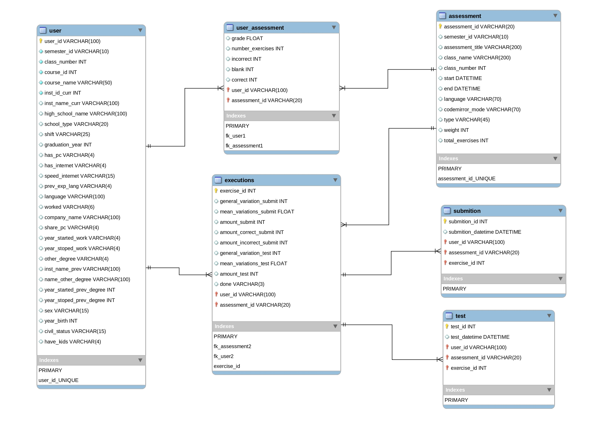

# Uso de técnicas de Mineração de dados na predição de evasão escolar em turmas de Introdução à Programação

Este repositório armazena os arquivos usados no meu trabalho de Iniciação Científica durante a graduação em Sistemas de Informação na Universidade do Estado do Amazonas (UEA) realizado no período de Agosto de 2019 a Julho de 2020. Ele foi realizado dentro da área de mineração de dados e teve como objeto de estudo arquivos de *logs* gerados pelo juiz online [Codebench](https://codebench.icomp.ufam.edu.br/) a partir de interações dos alunos e a plataforma.

## Modelagem do banco de dados

A partir da análise dos *logs* do sistema foi possível identificar atributos referentes aos estudantes e estruturar diferentes bases de dados, o objtivo maior nesta tarefa foi reconhecer e extrair o máximo de dados de uso da plataforma a seguir temos um diagrama da base de dados inicial.

## Notebooks

Os notebooks aqui presentes são de extrações de dados, treinamento de modelos, experimentos e analise dos dados.

## Resultados

Após os experimentos e testes foram geradas planilhas com os resultados e apresentam os resultados de cada modelo quando treinado e testado com dados uma mesma turma e em turmas diferentes.
